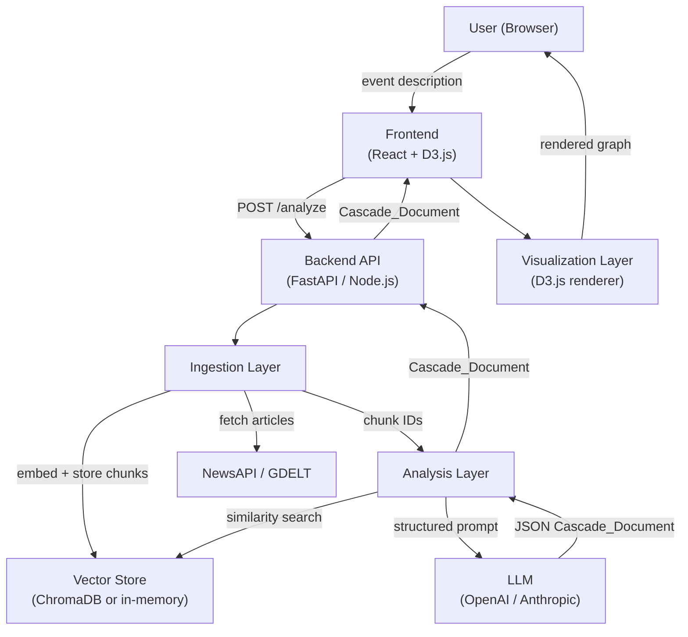

# Design Document: Economic Cascade Analyzer

## Overview

The Economic Cascade Analyzer is a three-layer pipeline that transforms a plain-language news event description into an interactive causal graph. A user types something like "Iran closes the Strait of Hormuz" and within 60 seconds sees a color-coded force graph showing oil supply disruption → fuel price spikes → airline cost increases → reduced air travel → tourism sector contraction, with each node annotated by how many independent sources agree on the causal link.

The system is designed to be built incrementally in five demoable stages:

1. **Static demo** — hardcoded Strait of Hormuz Cascade_Document rendered by the Visualization Layer (proves the schema and graph work before any LLM is involved)
2. **Single-article LLM pipeline** — Analysis Layer extracts a Cascade_Document from one article chunk
3. **Multi-source ingestion + triangulation** — Ingestion Layer fetches real articles, embeds them, and the Analysis Layer triangulates claims
4. **Confidence scoring** — Confidence_Score computed from source agreement/conflict counts
5. **Live end-to-end** — full pipeline wired together with progress indicators

The JSON Cascade_Document schema (Requirement 6) is the contract between all three layers and is locked in at Stage 1.

---

## Architecture



### Key Architectural Decisions

**Decision 1: JSON Cascade_Document as the single contract**
All three layers communicate through the Cascade_Document schema. The Visualization Layer has no knowledge of how the document was produced; the Ingestion Layer has no knowledge of how it will be rendered. This allows each layer to be developed, tested, and replaced independently.

**Decision 2: Backend orchestration**
The pipeline is orchestrated server-side (FastAPI or Express). The frontend sends one request and receives one Cascade_Document (or a stream of progress events via Server-Sent Events). This keeps the LLM API keys off the client and simplifies retry logic.

**Decision 3: Server-Sent Events for progress**
Because the pipeline can take up to 60 seconds, the backend streams progress events (`ingestion_started`, `ingestion_complete`, `analysis_started`, `analysis_complete`, `render_ready`) to the frontend so the user sees live stage updates.

**Decision 4: Pluggable vector store**
The Vector Store interface is abstracted so that an in-memory store (for local dev / Stage 1–2) can be swapped for ChromaDB (Stage 3+) without changing the Analysis Layer.

**Decision 5: LLM-agnostic Analysis Layer**
The Analysis Layer calls the LLM through a thin adapter interface. OpenAI and Anthropic are the initial targets. Structured output (JSON mode / tool-calling) is used to enforce schema conformance and reduce retry frequency.

---

## Components and Interfaces

### 3.1 Ingestion Layer

**Responsibilities:**
- Validate the event description (length 10–1000 characters)
- Query NewsAPI and/or GDELT for relevant articles
- Chunk articles into ≤512-token segments
- Embed chunks and store them in the Vector Store
- Return a list of chunk IDs and source metadata to the Analysis Layer

**Interface:**

```typescript
interface IngestionRequest {
  event_description: string;   // 10–1000 chars
  max_articles?: number;       // default 10, max 20
}

interface IngestionResult {
  sources: Source[];           // metadata for retrieved articles
  chunk_ids: string[];         // IDs of stored vector chunks
  warnings: string[];          // e.g. "only 3 articles found"
}

interface Source {
  id: string;
  url: string;
  title: string;
  published_at: string;        // ISO 8601
}
```

**Article retrieval strategy:**
- Primary: NewsAPI (requires API key)
- Fallback: GDELT (free, no key required)
- If both fail, surface error to orchestrator

**Chunking strategy:**
- Split on sentence boundaries, targeting 400 tokens per chunk with 50-token overlap
- Hard cap at 512 tokens per chunk
- Each chunk carries metadata: `{ source_id, chunk_index, token_count }`

**Embedding model:**
- Default: `text-embedding-3-small` (OpenAI) — 1536 dimensions, cost-effective
- Fallback: `all-MiniLM-L6-v2` (local, via sentence-transformers) for offline use

### 3.2 Vector Store

**Responsibilities:**
- Store embedded chunks with metadata
- Support top-K semantic similarity search given a query string or vector

**Interface:**

```typescript
interface VectorStore {
  upsert(chunks: EmbeddedChunk[]): Promise<void>;
  search(query: string, k: number): Promise<ChunkResult[]>;
  clear(): Promise<void>;
}

interface EmbeddedChunk {
  id: string;
  vector: number[];
  text: string;
  metadata: { source_id: string; chunk_index: number };
}

interface ChunkResult {
  id: string;
  text: string;
  score: number;
  metadata: { source_id: string; chunk_index: number };
}
```

**Implementations:**
- `InMemoryVectorStore` — cosine similarity over a flat array; suitable for ≤500 chunks
- `ChromaDBVectorStore` — wraps the ChromaDB HTTP client; suitable for production

### 3.3 Analysis Layer

**Responsibilities:**
- Retrieve the top-K most relevant chunks from the Vector Store for the event description
- Construct a structured prompt instructing the LLM to identify Direct, Indirect, and Second_Order effects
- Parse and validate the LLM response against the Cascade_Document schema
- Retry up to 2 times on schema validation failure
- Compute Confidence_Scores and set `single_source` flags
- Return a validated Cascade_Document

**Interface:**

```typescript
interface AnalysisRequest {
  event_description: string;
  sources: Source[];
  chunk_ids: string[];
}

interface AnalysisResult {
  cascade_document: CascadeDocument;
}
```

**Prompt structure:**

```
System: You are an economic analyst. Given the following news article excerpts about an event, 
identify the direct, indirect, and second-order economic effects as a causal chain.
Return ONLY a valid JSON object matching this schema: [schema].

User: Event: {event_description}

Article excerpts:
[chunk_1_text] (source_id: {id})
[chunk_2_text] (source_id: {id})
...

Identify all causal economic effects. For each effect, cite the source IDs that support it.
```

**Confidence scoring formula:**
```
confidence_score = supporting / (supporting + conflicting)
                 = 0.0 if supporting == 0 and conflicting == 0
```

**Triangulation logic:**
- Two nodes are considered to assert the same claim if their labels have cosine similarity ≥ 0.85 (using the same embedding model)
- When two nodes from different sources match, their `supporting_source_ids` are merged
- When two nodes from different sources contradict (detected via negation keywords + low similarity), both are added to `conflicting_source_ids`

### 3.4 Visualization Layer

**Responsibilities:**
- Accept a Cascade_Document and render it as an interactive D3.js graph
- Support force-directed and collapsible tree layouts
- Color-code nodes by Confidence_Score (red → green)
- Show dashed border on `single_source` nodes
- Display a detail panel on node click
- Auto-collapse Indirect and Second_Order nodes when node count > 50

**Interface:**

```typescript
interface VisualizationProps {
  cascade_document: CascadeDocument;
  layout: 'force' | 'tree';
  onLayoutChange: (layout: 'force' | 'tree') => void;
}
```

**Color scale:**
- Uses D3's `d3.interpolateRdYlGn` continuous scale
- `confidence_score = 0.0` → red (`#d73027`)
- `confidence_score = 0.5` → yellow (`#ffffbf`)
- `confidence_score = 1.0` → green (`#1a9850`)

**Node detail panel fields:**
- Label, type (direct / indirect / second_order)
- Confidence score (numeric + color swatch)
- Supporting sources: title + URL (clickable)
- Conflicting sources: title + URL (clickable)
- `single_source` warning badge if applicable

### 3.5 Orchestrator / Backend API

**Endpoints:**

```
POST /api/analyze
  Body: { event_description: string }
  Response: text/event-stream (SSE)
    data: { stage: "ingestion_started" }
    data: { stage: "ingestion_complete", source_count: N }
    data: { stage: "analysis_started" }
    data: { stage: "analysis_complete" }
    data: { stage: "render_ready", cascade_document: CascadeDocument }
    data: { stage: "error", failed_stage: string, message: string }

GET /api/health
  Response: { status: "ok" }
```

---

## Data Models

### 4.1 Cascade_Document (canonical schema)

This is the locked contract between all three layers. It is defined in Requirement 6 and reproduced here as a TypeScript interface for implementation reference.

```typescript
interface CascadeDocument {
  event: string;
  retrieved_at: string;          // ISO 8601
  sources: Source[];
  nodes: CascadeNode[];
  edges: CascadeEdge[];
}

interface Source {
  id: string;                    // unique, e.g. "src_001"
  url: string;
  title: string;
  published_at: string;          // ISO 8601
}

interface CascadeNode {
  id: string;                    // unique, e.g. "node_001"
  label: string;                 // human-readable effect description
  type: 'direct' | 'indirect' | 'second_order';
  confidence_score: number;      // [0.0, 1.0]
  single_source: boolean;
  supporting_source_ids: string[];
  conflicting_source_ids: string[];
}

interface CascadeEdge {
  from_node_id: string;          // must reference a node id
  to_node_id: string;            // must reference a node id
  label?: string;                // optional causal description
}
```

### 4.2 Referential Integrity Rules

1. Every `from_node_id` and `to_node_id` in `edges` MUST exist in `nodes[*].id`
2. Every ID in `supporting_source_ids` and `conflicting_source_ids` MUST exist in `sources[*].id`
3. `confidence_score` MUST be in [0.0, 1.0]
4. `type` MUST be one of `'direct'`, `'indirect'`, `'second_order'`

### 4.3 Static Demo Document (Stage 1)

The Strait of Hormuz hardcoded document used in Stage 1 will contain:
- 1 event string
- 3 mock sources
- 8 nodes (2 direct, 3 indirect, 3 second_order)
- 7 edges forming a tree rooted at the event
- Confidence scores ranging from 0.33 to 1.0 to exercise the full color scale

### 4.4 Internal Chunk Metadata

```typescript
interface ChunkMetadata {
  source_id: string;
  chunk_index: number;
  token_count: number;
  text: string;
}
```

---

## Correctness Properties

*A property is a characteristic or behavior that should hold true across all valid executions of a system — essentially, a formal statement about what the system should do. Properties serve as the bridge between human-readable specifications and machine-verifiable correctness guarantees.*

### Property 1: Input validation accepts valid lengths and rejects invalid lengths

*For any* string submitted as an event description, the Ingestion Layer SHALL accept it (return no validation error) if and only if its length is in the range [10, 1000] characters, and SHALL reject it with an appropriate error message otherwise.

**Validates: Requirements 1.1, 1.2, 1.3**

---

### Property 2: Article count is bounded

*For any* valid event description submitted to the Ingestion Layer, the number of sources returned SHALL be at least 5 (or a warning is surfaced) and at most 20.

**Validates: Requirements 2.1, 2.2**

---

### Property 3: All chunks are within the token limit

*For any* article text of any length, every chunk produced by the Ingestion Layer's chunker SHALL have a token count of at most 512.

**Validates: Requirements 2.3**

---

### Property 4: Vector store top-K search returns the closest chunks

*For any* set of embedded chunks stored in the Vector Store and any query vector, the top-K results returned by `search()` SHALL be the K chunks with the highest cosine similarity to the query, in descending order.

**Validates: Requirements 2.6**

---

### Property 5: Cascade_Document schema conformance

*For any* LLM response processed by the Analysis Layer, the resulting Cascade_Document SHALL conform to the schema defined in Requirement 6 — including all required fields, correct types, and valid enum values for `type` and `confidence_score` range [0.0, 1.0].

**Validates: Requirements 3.2, 5.3, 6.1**

---

### Property 6: At least one direct effect is always present

*For any* event description that has at least one retrievable article, the Cascade_Document produced by the Analysis Layer SHALL contain at least one node with `type = 'direct'`.

**Validates: Requirements 3.3**

---

### Property 7: Referential integrity of edges and source references

*For any* valid Cascade_Document, every `from_node_id` and `to_node_id` in the `edges` array SHALL reference an `id` that exists in the `nodes` array, and every ID in `supporting_source_ids` and `conflicting_source_ids` on any node SHALL reference an `id` that exists in the `sources` array.

**Validates: Requirements 3.5, 6.2, 6.3**

---

### Property 8: Source agreement produces multiple supporting IDs; every node has source arrays

*For any* set of sources where two or more independently assert the same causal relationship, the corresponding node in the Cascade_Document SHALL have `supporting_source_ids.length >= 2`. Additionally, *for any* node in any Cascade_Document, both `supporting_source_ids` and `conflicting_source_ids` SHALL be present as arrays (possibly empty).

**Validates: Requirements 4.1, 4.3**

---

### Property 9: Source conflict populates conflicting source IDs

*For any* set of sources where two or more make contradictory assertions about the same causal relationship, the corresponding node in the Cascade_Document SHALL have `conflicting_source_ids.length >= 1`.

**Validates: Requirements 4.2**

---

### Property 10: Single-source flag invariant

*For any* node in a Cascade_Document where `supporting_source_ids.length == 1` and `conflicting_source_ids.length == 0`, the `single_source` field SHALL be `true`. *For any* node where `supporting_source_ids.length != 1` or `conflicting_source_ids.length > 0`, `single_source` SHALL be `false`.

**Validates: Requirements 4.4**

---

### Property 11: Confidence score formula correctness

*For any* node with `s` supporting sources and `c` conflicting sources, the `confidence_score` SHALL equal `s / (s + c)` when `s + c > 0`, and SHALL equal `0.0` when both `s` and `c` are zero.

**Validates: Requirements 5.1, 5.2**

---

### Property 12: Color mapping is monotone on the confidence scale

*For any* confidence score `x` in [0.0, 1.0], the color produced by the Visualization Layer's color mapping function SHALL be a valid hex color on the red-to-green scale, and *for any* two scores `x < y`, the green channel of `color(y)` SHALL be greater than or equal to the green channel of `color(x)`.

**Validates: Requirements 5.4**

---

### Property 13: JSON round-trip preserves the Cascade_Document

*For any* valid Cascade_Document, serializing it to a JSON string and then deserializing that string SHALL produce a deeply equal Cascade_Document with identical field values, node counts, edge counts, and source counts.

**Validates: Requirements 6.5**

---

### Property 14: Visualization renders all nodes and edges from any valid document

*For any* valid Cascade_Document, the Visualization Layer SHALL render without throwing an error, and the rendered graph SHALL contain exactly as many node elements as `nodes` in the document and exactly as many edge elements as `edges` in the document.

**Validates: Requirements 6.4, 7.1**

---

### Property 15: Node detail panel shows correct data for any clicked node

*For any* valid Cascade_Document and any node within it, simulating a click on that node's rendered element SHALL cause the detail panel to display the node's `label`, `type`, `confidence_score`, and the `title` and `url` of every source referenced in `supporting_source_ids` and `conflicting_source_ids`.

**Validates: Requirements 7.3**

---

### Property 16: Auto-collapse for large documents

*For any* Cascade_Document containing more than 50 nodes, the initial render state of the Visualization Layer SHALL have all `direct` nodes expanded and all `indirect` and `second_order` nodes collapsed.

**Validates: Requirements 7.5**

---

## Error Handling

### Ingestion Layer Errors

| Condition | Behavior |
|---|---|
| Event description < 10 chars | Return `ValidationError` with message stating minimum length |
| Event description > 1000 chars | Return `ValidationError` with message stating maximum length |
| NewsAPI request fails | Log error, attempt GDELT fallback |
| Both NewsAPI and GDELT fail | Return `IngestionError` with stage identifier |
| < 5 articles returned | Proceed with warning in `IngestionResult.warnings` |

### Analysis Layer Errors

| Condition | Behavior |
|---|---|
| LLM returns invalid JSON | Retry up to 2 additional times (3 total attempts) |
| All 3 LLM attempts fail schema validation | Return `AnalysisError` with last raw LLM response for debugging |
| LLM API rate limit / timeout | Retry with exponential backoff (1s, 2s, 4s) before failing |
| Zero direct effects in LLM output | Log warning; if retries exhausted, return document as-is with warning flag |

### Visualization Layer Errors

| Condition | Behavior |
|---|---|
| Invalid Cascade_Document received | Display schema validation error message; do not attempt render |
| D3 render throws | Catch error, display "Render failed" message with raw JSON download option |
| Node count > 200 | Warn user about performance; offer to render top 50 nodes by confidence score |

### Orchestrator / Pipeline Errors

| Condition | Behavior |
|---|---|
| Any stage fails | Emit `{ stage: "error", failed_stage: "<stage>", message: "<description>" }` SSE event |
| Client disconnects mid-stream | Cancel in-flight LLM request; clean up vector store session |
| Pipeline exceeds 60s | Emit timeout error with partial results if available |

---

## Testing Strategy

### Dual Testing Approach

The testing strategy combines **unit/example-based tests** for specific behaviors and **property-based tests** for universal correctness guarantees. Both are necessary: unit tests catch concrete bugs in known scenarios; property tests verify general correctness across the full input space.

### Property-Based Testing Library

- **JavaScript/TypeScript**: [fast-check](https://github.com/dubzzz/fast-check) (v3.x)
- Each property test runs a minimum of **100 iterations**
- Each test is tagged with a comment referencing the design property:
  ```typescript
  // Feature: economic-cascade-analyzer, Property 1: Input validation accepts valid lengths and rejects invalid lengths
  ```

### Unit / Example-Based Tests

Focus areas:
- Validation error messages contain the correct text (1.2, 1.3)
- LLM retry logic: exactly 3 calls made on repeated schema failures (3.4)
- Fallback from NewsAPI to GDELT on failure (2.5)
- SSE events emitted for each pipeline stage (8.2)
- Error message identifies the failed stage (8.3)
- Drag interaction does not trigger re-analysis (7.4)
- Both layout modes render without error (7.2)
- `single_source` visual indicator present on flagged nodes (5.5)

### Integration Tests

- Full pipeline with mocked external services (NewsAPI, GDELT, LLM, embedding model): verify end-to-end flow produces a rendered graph (8.1)
- Vector store upsert + search round-trip with real ChromaDB instance (2.4)
- LLM adapter: verify OpenAI and Anthropic adapters produce valid Cascade_Documents (3.1)

### Smoke Tests

- Render performance: 50-node document renders in < 2 seconds (7.6)
- Pipeline SLA: full pipeline with mocked services completes in < 60 seconds (8.4)

### Stage-by-Stage Test Plan

| Stage | Tests to pass before moving on |
|---|---|
| Stage 1 (static demo) | Properties 13, 14; schema validation unit test |
| Stage 2 (single-article LLM) | Properties 5, 6, 7; LLM retry unit test |
| Stage 3 (multi-source ingestion) | Properties 2, 3, 4, 8, 9; integration test for vector store |
| Stage 4 (confidence scoring) | Properties 10, 11, 12; single_source unit test |
| Stage 5 (live end-to-end) | Properties 1, 15, 16; all integration and smoke tests |

### Test File Structure

```
tests/
  unit/
    ingestion/
      validate_input.test.ts       # Property 1
      chunker.test.ts              # Property 3
    analysis/
      confidence_score.test.ts     # Properties 10, 11
      schema_validation.test.ts    # Property 5
      referential_integrity.test.ts # Property 7
      triangulation.test.ts        # Properties 8, 9
    visualization/
      color_mapping.test.ts        # Property 12
      render_completeness.test.ts  # Property 14
      detail_panel.test.ts         # Property 15
      auto_collapse.test.ts        # Property 16
    shared/
      cascade_document_roundtrip.test.ts # Property 13
  integration/
    pipeline.test.ts
    vector_store.test.ts
  smoke/
    render_performance.test.ts
    pipeline_sla.test.ts
```
